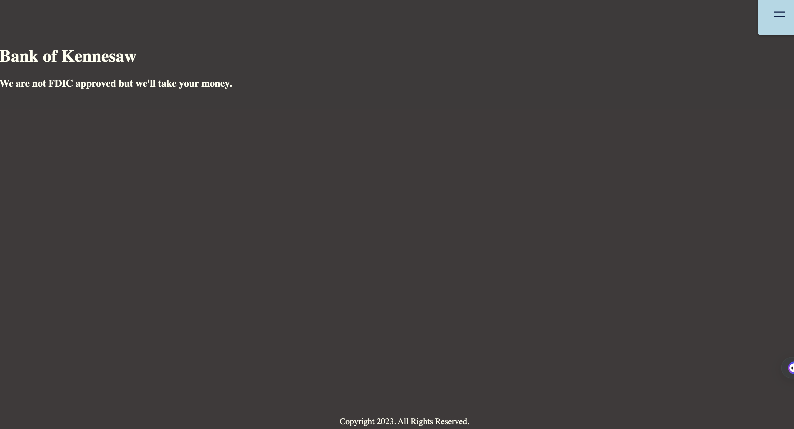
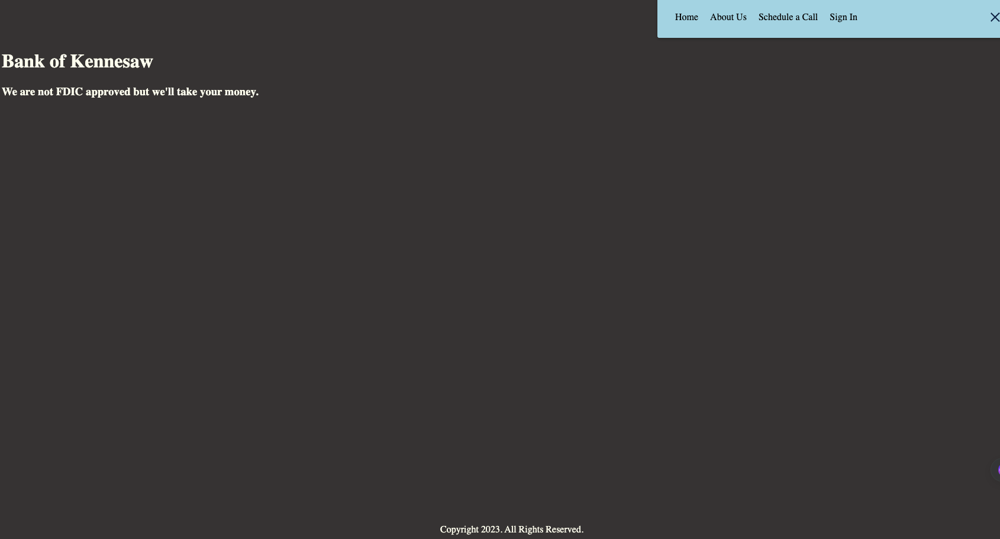
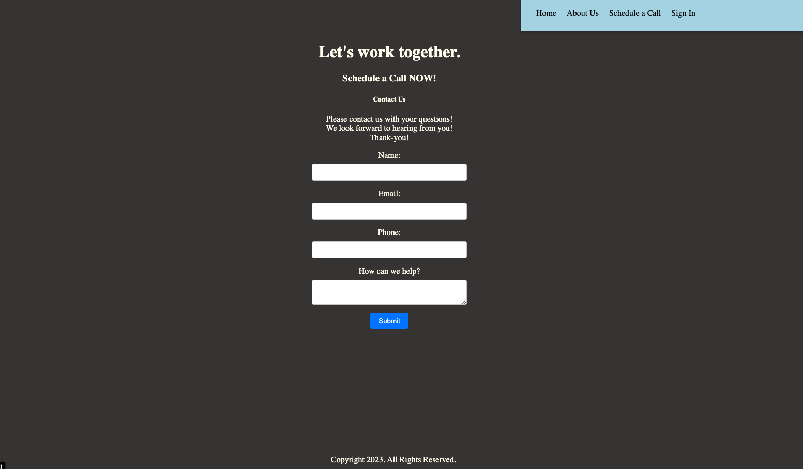
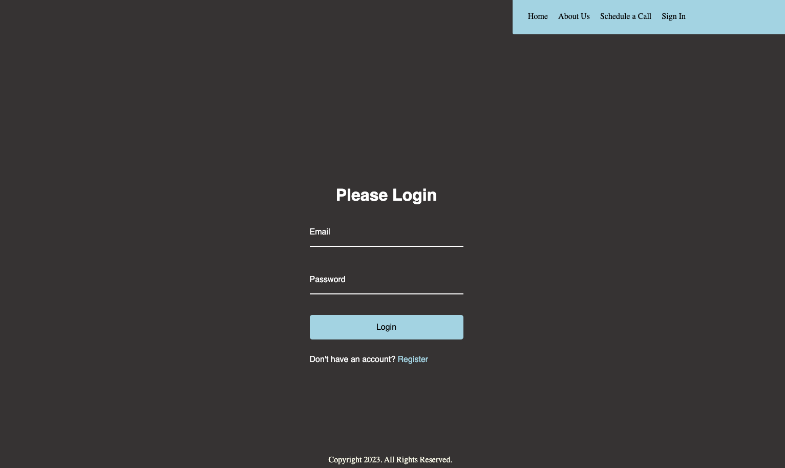
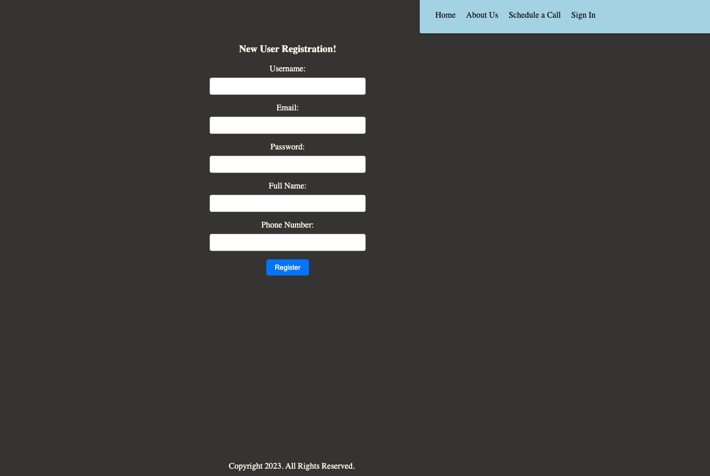

# BankOfKennesaw

A banking application  that enables users to conveniently manage their finances. With a user-friendly interface, a wide range of features and services are currently under construction. Features include secure access to accounts, view balances, and transaction monitoring in real-time. The application will provide seamless functionality for transferring funds between accounts, paying bills, and setting up automatic payments. While allowing users to deposit checks remotely using their mobile devices. Advanced security measures, such as biometric authentication and encryption, will ensure the protection of sensitive information. The application's ultimate goal is to provide personalized financial insights, budgeting tools, and transaction categorization for users to effectively track and manage their expenses.

# Phase 1 is characterized by the development of basic application structure and functionality.

